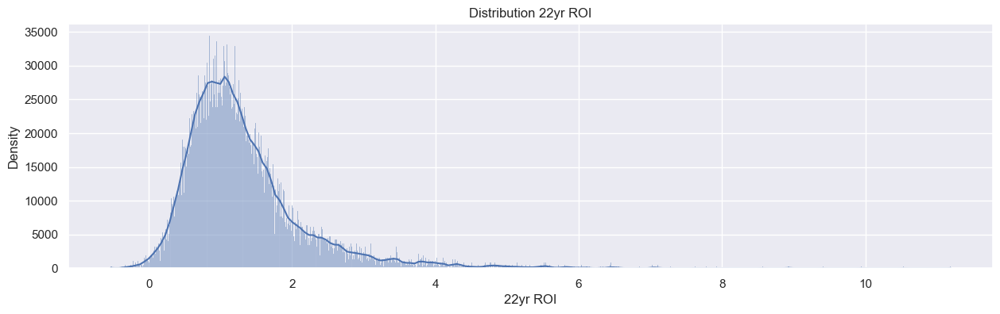
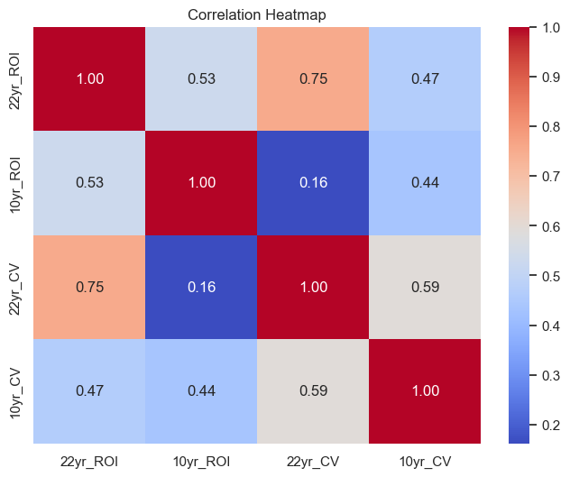

# HOUSE MARKET ANALYSIS

## INTRODUCTION

Real estate is a profitable business in every economy worldwide. This is contributed by a variety of factors such as the increase of the people's population growth in the majority of countries. In our dataset, we will be looking at the United States housing market which has changed drastically over the past decades. The real estate market in the United States is among the competitive industry.

Real estate plays a huge role in helping individuals, investors, real estate professionals, and policymakers make informed decisions concerning the sector.

The dataset we have been given contains a lot of information on various aspects of the housing market. Analyzing the dataset will help in understanding the housing market in the United States.

## BUSINESS UNDERSTANDING

It is crucial for different groups of people to understand the real estate market, including real estate brokers, property investors, government organizations, and financial institutions. The Zillow dataset is useful in answering critical questions about housing trends, economic stability, and investment opportunities.

The potential business in this dataset can be used in real estate investors can analyze the historical trends to identify regions with the highest potentials for returns on investment.

## PROBLEM STATEMENT

The main goal of analyzing this dataset is to gain insights into the housing market trends in different regions of the United States over a span of several years. From the several factors, our primary objective that we aim to achieve are:

* What have been the historical price trends in different places, and how they have changed over time?

* To determine which factors influence property value and to what extent.

* To use a time series analysis to predict the best areas to invest in based on their Return Of Investment (ROI) between 1996 and 2018.

## DATA UNDERSTANDING

The data used in this project is a sample of the US real estate market collected from Zillow housing data. The data includes median house prices from 1996 to 2018, as well as the regions where the residents are situated. The data also contains the city names and the metropolitan areas where the houses are located.
The data also has 14723 rows and 272 columns. The data will be melted for better analysis.

## EXPLORATORY DATA ANALYSIS

* Univariate Analysis

* Bivariate Analysis

* Multivariate

## TIME SERIES EDA

Time Series Exploratory Data Analysis (Time Series EDA) is the process of visually and quantitatively analyzing a time series dataset to acquire insights, detect patterns, and understand the underlying properties of the data. Time series data is made up of observations or measurements taken at regular intervals over time.

## TIME SERIES DECOMPOSITION

## CONCLUSIONS

* The model for region '60657' has been successfully applied to the time series, resulting in good model performance.

* The model generated useful predictions for the region's median dwelling price.

*  House costs vary depending on where you live in the region. The median price of a home in a high-ranking region is high.

* The SARIMAX (Seasonal Autoregressive Integrated Moving Average with Exogenous Variables) model was successfully applied to area 60657 time series data.

## RECOMMENDATIONS

* Due to the lowering of real estate prices in the near future, sell at a discount to boost house sales over the following few years.

* More data with social features, such as schools and hospitals, would be more useful in advising the customer depending on the housing amenities they seek.
